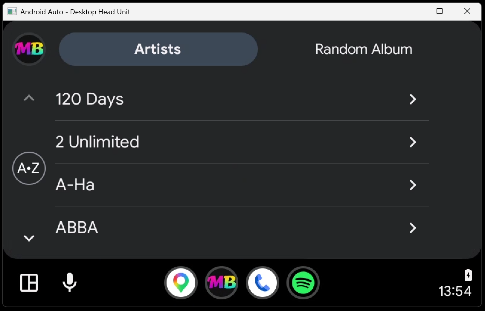
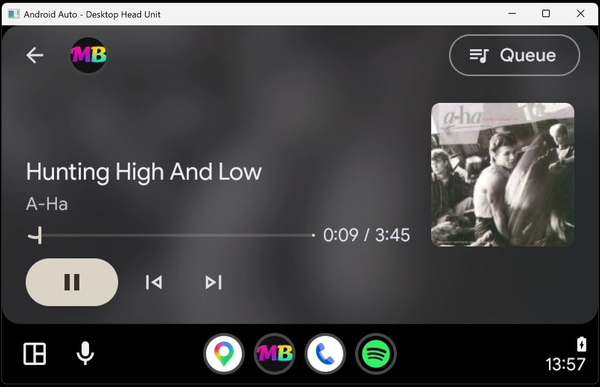

# MusicBuddy for Android Auto

A sideloadable Android app that lets you browse and play your MusicBuddy library on an
Android Auto head unit. The phone stays in your pocket — the car screen is the UI!

- **Browse**: Artists → artist → album → tracks
- **Random Album**: a **"Roll the dice!"** button that shows five random albums
  from your library
- **Playback**: streams MP3s from your MusicBuddy server with ExoPlayer; album art,
  steering-wheel controls, and audio focus (ducks/pauses for nav prompts and calls)
  come from the MediaSession

## Screenshots

<table>
  <tr>
    <td align="center" width="50%">
      <br/>
      <b>Browse</b> — Artists and Random Album tabs with your full artist list
    </td>
    <td align="center" width="50%">
      <br/>
      <b>Artist</b> — that artist's albums with cover art
    </td>
  </tr>
  <tr>
    <td align="center" width="50%">
      <br/>
      <b>Album</b> — full track list; tap any track to queue the whole album
    </td>
    <td align="center" width="50%">
      <br/>
      <b>Now Playing</b> — album art, seek bar, transport controls, and the queue
    </td>
  </tr>
</table>

## How it works

```
Car head unit (Android Auto)          Phone                          Your server
┌──────────────────────┐   BT/WiFi   ┌─────────────────────┐        ┌────────────────────┐
│ AA UI (Google-rendered) │◄────────►│ MusicBuddyAndroid    │───────►│ MusicBuddyWeb      │
└──────────────────────┘  commands   │  └ MediaLibraryService│       │  ├ /api/session    │
                                     │      └ ExoPlayer      │──────►│  ├ /api/** (proxy) │
                                     └─────────────────────┘        │  └ /Music/** (MP3) │
                                                                    └────────────────────┘
```

The app logs in through a new `POST /api/session` endpoint on the web app (same cookie
as the browser login), browses via the existing API proxy, and streams MP3s straight
from the static `/Music/...` files. Keep the phone online — cellular is fine; the
server only needs to be reachable at the URL you configured.

## Prerequisites

1. A Windows machine with **Visual Studio** and the **.NET Multi-platform App UI development**
   workload (or at least the Android SDK + .NET Android workload:
   `dotnet workload install android`)
2. Your MusicBuddy server reachable from the phone (the URL you use in a browser)
3. An Android phone with **developer options** enabled (Settings → About → tap Build number 7×)
4. The **Android Auto** app on the phone

## Build the APK

1. Open `MusicBuddy.slnx` in Visual Studio on Windows
2. Set **MusicBuddyAndroid** as the startup project
3. Build → Deploy to a connected phone (USB or wireless debugging), **or** build a
   release APK: right-click project → Publish → Android → Create new publish profile →
   Build → produces `*-Signed.apk` under `bin\Release\net10.0-android36.0\publish\`

Command-line alternative (from a Developer PowerShell with the Android workload):

```powershell
dotnet build MusicBuddyAndroid/MusicBuddyAndroid.csproj -c Release
```

## Install on the phone (sideload)

Easiest: deploy from Visual Studio. Or copy the signed APK to the phone and open it
(you'll need to allow installs from the file manager / VS for the first time).

### Make it visible to Android Auto

Android Auto only shows sideloaded media apps when developer mode + unknown sources
are enabled:

1. Phone Settings → Apps → **Android Auto** → Additional settings in the app
   (or search "Android Auto" in Settings)
2. Scroll to the **Version** row and tap it **10 times** → "Developer mode enabled"
3. Open the ⋮ menu → **Developer settings** → enable **Unknown sources**
4. Reboot the phone (recommended after first enabling)

⚠️ **Gotcha**: Android Auto updates sometimes silently reset the "Unknown sources"
toggle. If MusicBuddy disappears from the car, re-check that setting first.

## First run

1. Open **MusicBuddy** on the phone (only once — after this the phone stays in your pocket)
2. Enter your server URL (e.g. `https://music.example.com`), username, and password → **Connect**
3. The credentials are stored on the phone; the app logs in silently in the background

To change server or user: open the app → **Log out** → connect again.

## Use in the car

1. Get in the car (phone connects to Android Auto automatically)
2. Open the app launcher on the car display → **MusicBuddy**
3. Browse **Artists** → artist → album → tap a track to play (the whole album is queued
   from that track)
4. **Random Album** → tap **Roll the dice!** → five randomly chosen albums appear →
   tap one to see its tracks; tap Roll the dice! again for five fresh suggestions

## Test without a car: Desktop Head Unit (DHU)

Google's Android Auto simulator runs on your PC:

1. Install the DHU from Google's car docs
   ([Test apps for cars](https://developer.android.com/training/cars/testing) →
   "Download the Desktop Head Unit") — it ships inside the Android SDK extras or as a
   standalone download
2. Enable developer mode + Unknown sources on the phone (see above), connect the phone
   via USB, enable USB debugging
3. On the phone's Android Auto app: Developer settings → **Start head unit server**
4. On the PC, launch the DHU and accept the USB debugging prompt on the phone
5. The DHU shows a simulated car display — MusicBuddy should appear in its app launcher

## Server notes

- `/Music/**` requires a login cookie; the Android app attaches its cookie automatically
- `POST /api/session` (JSON `{ "username", "password" }`) issues the same
  `MusicBuddyAuth` cookie as the browser login, with the same rate limit
- Logout: `DELETE /api/session`

## Project layout

```
MusicBuddyAndroid/
├── MainActivity.cs                       one-time setup screen (URL + login)
├── MusicBuddyMediaService.cs             MediaLibraryService (what AA binds to)
├── Session/
│   ├── MusicBuddyLibrarySessionCallback.cs   browse tree (Artists / Random Album)
│   ├── AlbumSlot.cs                          full-album queue for track taps
│   ├── ArtCache.cs                           in-memory album art cache
│   ├── CatalogCache.cs                       10-min cache of /api/albums
│   └── BrowseIds.cs                          media ID scheme
├── Api/
│   ├── MusicBuddyClient.cs               login, cookie, re-auth on 401
│   ├── MusicBuddyModels.cs               DTOs mirroring the API payloads
│   └── Json.cs
├── Playback/CookieDataSourceFactory.cs   cookie-injecting stream + art loader
└── Security/CredentialStore.cs           SharedPreferences
```
