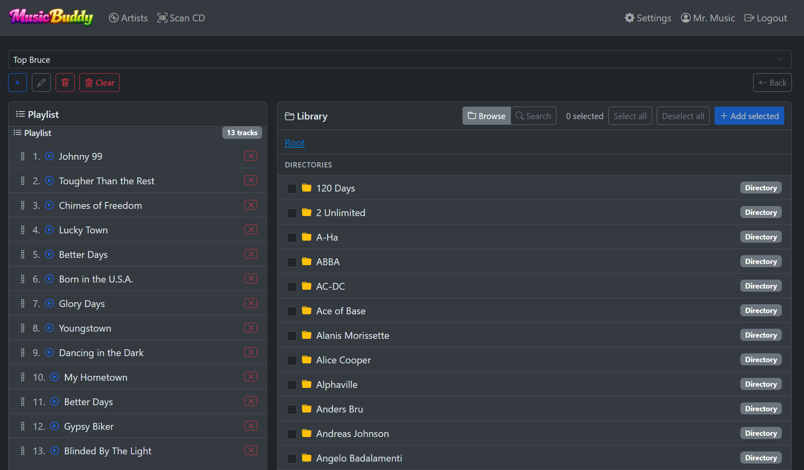
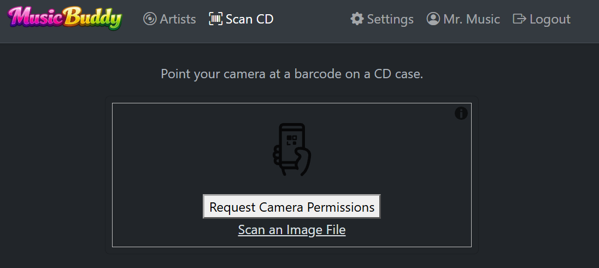

# MusicBuddy

MusicBuddy is a self-hosted, multi-user music player and library manager for local music collections. It plays MP3 files and Commodore 64 SID music in the browser, organizes them into browsable artist/album catalogs, manages playlists, and includes a CD barcode scanner that can look up album metadata via online databases - a must while thrifting old CD's.

## Screenshots

<table>
  <tr>
    <td align="center" width="50%">
      <br/>
      <b>MP3 Player</b> — Browser-based playback with album art, VU meters, and SID engine selection
    </td>
    <td align="center" width="50%">
      <br/>
      <b>Album Player</b> — Dedicated album playback with track listing and random play modes
    </td>
  </tr>
  <tr>
    <td align="center" width="50%">
      <br/>
      <b>Playlist Manager</b> — Drag-and-drop playlist editor with library browser and search
    </td>
    <td align="center" width="50%">
      <br/>
      <b>CD Barcode Scanner</b> — Camera-based barcode scanning with online album lookup
    </td>
  </tr>
</table>

## Features

- **MP3 & SID Player** — Browser-based playback with gapless transitions. Two SID engines (jsSID and WebSid) with SID chip model selection and subtune support.
- **VU Meters** — Canvas-based visual VU meters with 8 selectable styles!
- **Album Catalog** — Scans your MP3 root directory to build a browsable artist/album hierarchy with album art thumbnails and metadata. Includes an "Uncatalogued" section for loose files.
- **Album Player** — Dedicated album playback page with inline track list, gapless playback, and random play modes (by song, artist, or genre). Play one album at the time or rediscover your music using the random feature!
- **Playlist Manager** — Curate the Playlist of your dreams! Browse the file system hierarchy or search by song name, artist, and genre. Drag-and-drop reordering with auto-save.
- **CD Barcode Scanner** — Camera-based barcode scanning. Looks up albums via the iTunes Search API with fallback to Discogs. Matches results against your local collection to see if you already have it or if this is something spanking new.
- **Theming** — Built-in Light and Dark themes plus a full custom theme creator with per-user themes.
- **Multi-User** — Role-based access (Admin and regular users), account management, password change, and user aliases.
- **Track Metadata Index** — Background indexing of MP3 metadata into a SQLite database, powering multi-field search with pagination and sorting.
- **Session Resume** — Remembers the last-playing playlist and track across page reloads.

## Architecture

MusicBuddy is built as a three-project .NET solution:

```
MusicBuddyWeb/      ASP.NET Core Razor Pages front-end
MusicBuddyAPI/      ASP.NET Core Web API back-end
MusicBuddyShared/   Shared class library (models and DTOs)
```

**Stack:** ASP.NET Core 10.0, SQLite via Entity Framework Core, Bootstrap 5, htmx, jQuery.

**Data flow:**

```
Browser --> MusicBuddyWeb (Razor Pages + API Proxy)
              |
              +-- /api/** proxied to --> MusicBuddyAPI
              |                            |
              |                            +-- FileCacheService (reads MP3/SID from disk)
              |                            +-- TagLibSharp (ID3 tag reading)
              |                            +-- SQLite (users, playlists, themes, metadata)
              |
              +-- Static files served from wwwroot
```

Music files live on the local filesystem and are served as static files. The web project proxies all API requests to the back-end, forwarding authentication cookies. SQLite stores users, playlists, themes, settings, and the track metadata index. The database is auto-migrated on startup.

**External integrations:**

- **iTunes Search API** (Apple) — CD barcode lookup with no API key required. Queries multiple country stores (US, DK, GB) for best match.
- **Discogs API** — Fallback barcode lookup when iTunes has no match. Requires a personal access token configurable in Settings.

## Credits

Acknowledgements for open-source projects and services used in MusicBuddy.

| Project | Description | License |
|---------|-------------|---------|
| [Gapless-5](https://github.com/regosen/Gapless-5) | Gapless JavaScript audio player using HTML5 and WebAudio | MIT |
| [WebSid](https://github.com/wothke/websid) | Cycle-accurate C64 SID chip emulator compiled to WebAssembly | CC BY-NC-SA 4.0 |
| [jsSID](https://github.com/og2t/jsSID) | JavaScript SID chip emulator using Web Audio API (v0.9.1 by Hermit) | WTFPL |
| [html5-qrcode](https://github.com/mebjas/html5-qrcode) | Cross-platform QR/barcode scanning library | Apache-2.0 |
| [iTunes Search API](https://developer.apple.com/library/archive/documentation/AudioVideo/Conceptual/iTuneSearchAPI/Searching.html) | Album artwork and metadata lookup by barcode | Free (Apple) |
| [Discogs API](https://www.discogs.com/developers/) | Crowdsourced music database for barcode lookup fallback | Requires access token |
